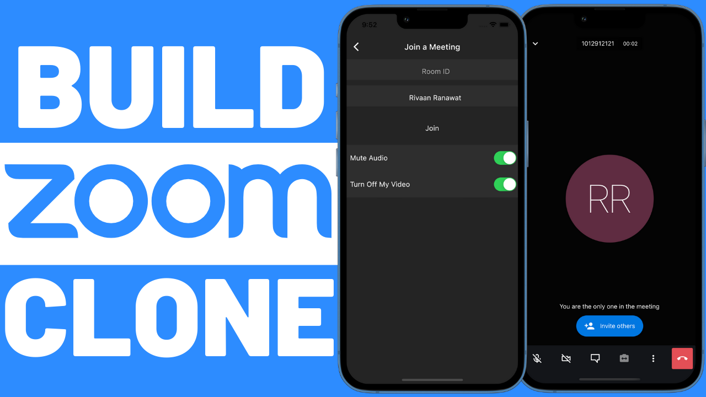

# Streamsync - Flutter Video Conferencing App

Streamsync is a Flutter-based video conferencing application inspired by Zoom, with additional features such as Google-backed Firebase authentication and Jitsi Meet integration for video conferencing.

## Features

- User-friendly interface for creating and joining video conferences.
- Secure authentication powered by Firebase with Google sign-in support.
- Real-time video conferencing using the Jitsi Meet framework.
  

## Getting Started

Follow these steps to get Streamsync up and running on your local machine or deployed to a server.

### Prerequisites

- [Flutter](https://flutter.dev/docs/get-started/install)
- [Firebase Account](https://firebase.google.com/) for authentication.
- [Jitsi Meet SDK](https://jitsi.github.io/handbook/docs/dev-guide/dev-guide-android-sdk) for video conferencing.

### Installation

1. Clone the repository:

   ```sh
   git clone https://github.com/yourusername/streamsync.git

Creating a comprehensive README.md file is crucial for your project's documentation. It helps users understand what your project does, how to set it up, and how to use it effectively. Below is a template for your Streamsync Flutter video conferencing app's README.md file:

markdown

# Streamsync - Flutter Video Conferencing App

Streamsync is a Flutter-based video conferencing application inspired by Zoom, with additional features such as Google-backed Firebase authentication and Jitsi Meet integration for video conferencing.



## Features

- User-friendly interface for creating and joining video conferences.
- Secure authentication powered by Firebase with Google sign-in support.
- Real-time video conferencing using the Jitsi Meet framework.
- [Add more features here]

## Getting Started

Follow these steps to get Streamsync up and running on your local machine or deployed to a server.

### Prerequisites

- [Flutter](https://flutter.dev/docs/get-started/install)
- [Firebase Account](https://firebase.google.com/) for authentication.
- [Jitsi Meet SDK](https://jitsi.github.io/handbook/docs/dev-guide/dev-guide-android-sdk) for video conferencing.

### Installation

1. Clone the repository:

   ```sh
   git clone https://github.com/yourusername/streamsync.git

2. Navigate to the project directory: cd streamsync
3. Install the required dependencies: flutter pub get
4. Configure Firebase:

   - Create a new Firebase project.
   - Add your Android and iOS apps in the Firebase project settings.
   - Download the google-services.json for Android and GoogleService-Info.plist for iOS.
   - Place these files in the appropriate locations in your Flutter project.
5. Configure Jitsi Meet:

   - Integrate the Jitsi Meet SDK according to their documentation.
   - Update the necessary configuration in the Flutter app to use Jitsi Meet.

## Usage
1. Run the app on your preferred device/emulator: flutter run
2. Sign up or sign in using your Google account.
3. Create a new conference or join an existing one using the provided options.
4. Enjoy seamless video conferencing with Streamsync!

## Contributions
Contributions are welcome! If you find any bugs or have suggestions for improvements, please open an issue or submit a pull request.

## Author
- Yugaansh Gautam

